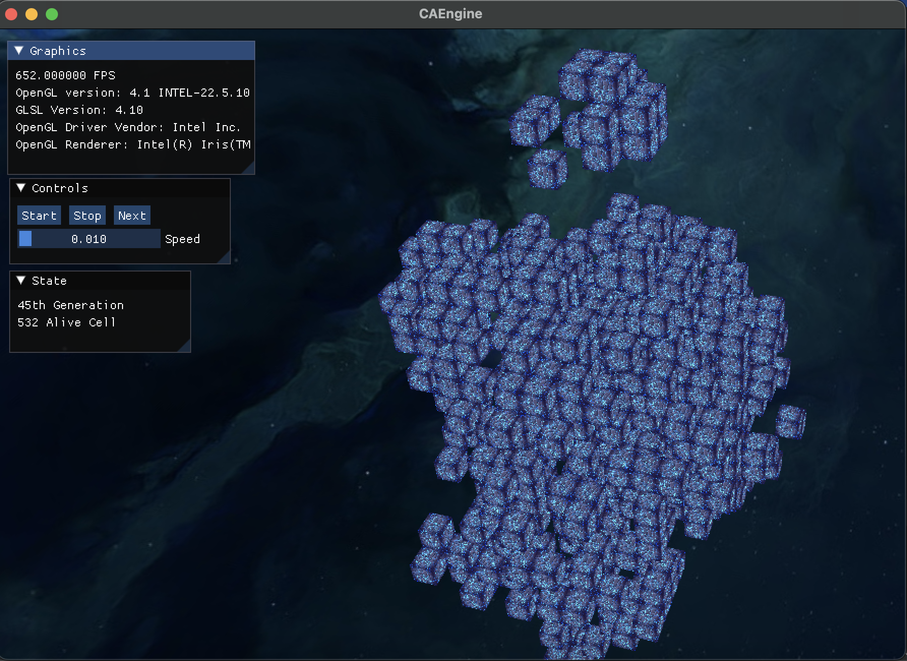

# Cubic Life
### Overview
Cubic Life is a powerful cellular automaton engine designed to simulate Conway's Game of Life in three dimension. This engine provides a flexible framework for running and visualizing complex cellular automata simulations in a 3D environment.

### Rules
+ A live cell that has live neighbors below 5 or above 6 dies.
+ A dead cell that has 4 live neighbors becomes a live cell.

### Features
+ **Infinite Grid:** No grid size limitation.
+ **Conway's Game of Life:** CAEngine is specifically designed to run Conway's Game of Life, a classic cellular automaton with simple rules but complex emergent behavior.
+ **3D Simulation:** Unlike traditional implementations which are 2D, CAEngine operates in a three-dimensional space, allowing for more intricate patterns and interactions.
+ **Flexible Architecture:** The engine is built with a modular architecture, making it easy to extend and customize for different cellular automaton rules and behaviors.
+ **Visualization:** CAEngine includes built-in visualization tools to observe the evolution of the cellular automaton in real-time, providing insights into the emergent patterns and dynamics.
+ **Configurability:** Users can adjust various parameters such as initial configurations, and simulation speed to tailor the behavior of the cellular automaton to their specific needs.
+ **Cross-Platform:** CAEngine is designed to be cross-platform, ensuring compatibility with various operating systems.
### Controls
| Key  | Action        |
|------|---------------|
| WASD | Move          |
| RMB  | Rotate camera |

### License
This project is licensed under the MIT License. See the LICENSE file for details.

### Credits
Developed by M. Sami Gürpınar
